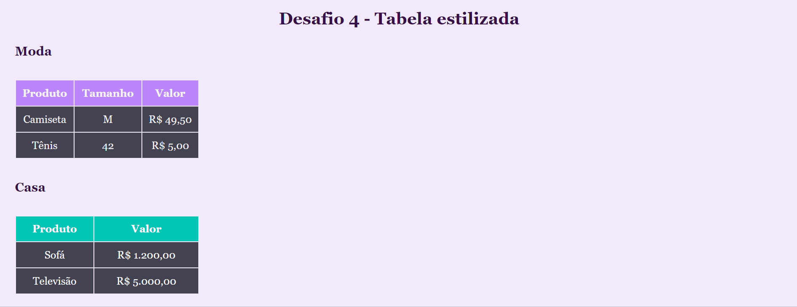

## Desafio 4 - HTML e CSS básico ⚔

Quest referente ao módulo de HTML e CSS básico, onde era necessário construir duas tabelas estilizadas de acordo com as seguintes especificações:

📝 Fazer uma tabela de roupas com tamanho e valor da peça descrito em cada linha.

=> Adicionar um cabeçalho em cada coluna.

=> Cor de fundo do cabeçalho moda - #BB86FC

=> Cor de fundo do cabeçalho casa - #00C4B4

=> Cor de fundo dos valores da tabela - #424250

❗ Regra: não estilizar usando as tags HTML, crie classes para estilizar sua tabela. 
EX: .produtos-casa th { … }

## Visualização
[]
